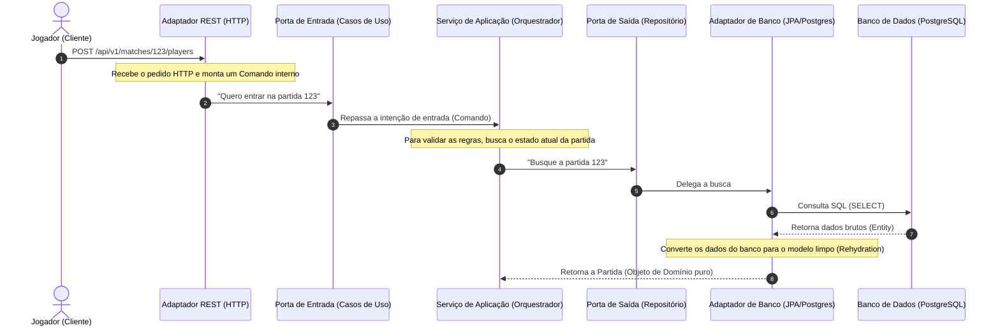
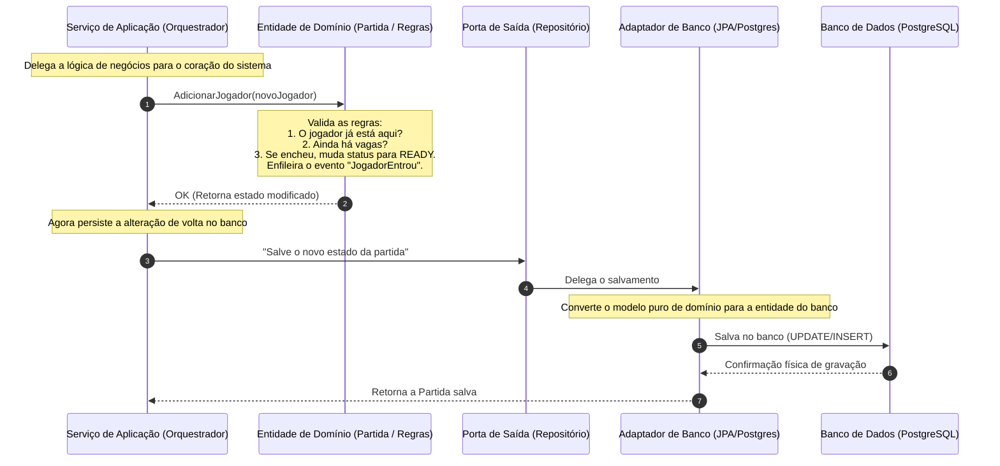
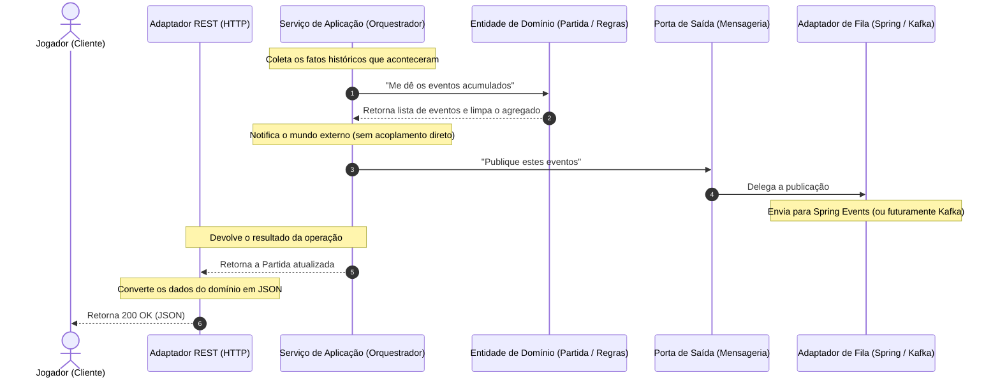

Se você já criou um projeto Spring Boot, a cena abaixo deve ser familiar.

Você cria um modelo de domínio, adiciona <code>@Entity</code> em cima da classe, enche os campos com <code>@Column</code>, <code>@Id</code> e <code>@GeneratedValue</code> e, quando percebe, a regra mais importante da sua empresa está ditada pelas limitações do Hibernate. Para piorar, injeta o <code>@Autowired</code> direto no meio da lógica e mistura tratamento HTTP com lógica de negócios.

O resultado? Seu código virou refém do framework. Trocar de banco, atualizar uma biblioteca ou rodar testes unitários rápidos virou um parto.

A **Arquitetura Hexagonal** (ou Portas e Adaptadores) resolve justamente isso. Ela não é sobre criar pastas bonitas; é sobre isolar o coração do seu sistema para que ele continue batendo limpo, independente de quem o chame ou de onde os dados sejam salvos.

Para ver como isso funciona na prática, vamos analisar o núcleo de um sistema de **matchmaking em tempo real** (uma plataforma para parear jogadores em partidas online).

---

## A analogia: Restaurante e fornecedores

Imagine um restaurante.

* **A cozinha e as receitas** são o Domínio.
* **A lista de ingredientes exigidos** é a Porta.
* **Os funcionários que recebem e conferem os ingredientes** são os Adaptadores.
* **Os fornecedores** são o banco de dados, APIs, filas etc. (a infraestrutura).

A receita não muda se você trocar o fornecedor de tomates. Desde que os ingredientes cheguem conforme a especificação, a cozinha funciona da mesma forma.

---

## O Mapa do Matchmaking

No nosso sistema de matchmaking, o objetivo é criar partidas, receber jogadores, balancear os times pelo nível de habilidade <code>skillRating</code>, começar o jogo e avisar o mundo sobre as mudanças.

A estrutura de pacotes do projeto segue essa divisão de forma rígida:

```
com.henriquemarino.matchmaking
├── domain          # O coração: regras puras (sem Spring, sem JPA)
│   ├── model       # Match (aggregate root), Player, GameMode...
│   └── events      # MatchCreatedEvent, PlayerJoinedMatchEvent...
├── application     # Orquestrador dos fluxos (Java puro, sem @Service)
│   └── usecases    # CreateMatchService, JoinMatchService...
├── ports           # Os contratos (interfaces)
│   ├── inbound     # O que o mundo de fora pode pedir (Use Cases)
│   └── outbound    # O que a aplicação precisa pedir ao mundo (Repository)
├── adapters        # Os funcionários que recebem os insumos (Adaptadores)
│   ├── inbound     # Controllers REST (HTTP -> API)
│   └── outbound    # JPA / PostgreSQL (Banco) e Spring Events (Mensageria)
└── config          # A central de injeção que une portas e adaptadores
```

A regra de ouro aqui é unidirecional: **as dependências sempre apontam para dentro**. 

O domínio está no centro e não conhece ninguém. A aplicação conhece o domínio e as portas. Os adaptadores conhecem as portas e o domínio. O pacote <code>config</code> conhece todo mundo para conseguir costurar as dependências na inicialização.

---

## O Fluxo de uma Ação (Cronológico)

O que acontece no sistema quando um jogador pede para entrar em uma partida? Para facilitar a leitura, dividimos esse fluxo cronológico em três etapas menores e bem delimitadas.

<Callout type="info" title="Interatividade">
Todos os diagramas abaixo possuem suporte a zoom! Se estiver no computador, passe o mouse sobre o diagrama e clique no botão <strong>Zoom</strong> no canto superior direito para ampliá-lo, arrastá-lo com o mouse e inspecioná-lo confortavelmente de perto.
</Callout>

<figure className="my-8 border border-border/50 rounded-xl bg-light/30 p-5">
  <div className="flex items-center gap-2.5 mb-4 border-b border-border/40 pb-3">
    <span className="bg-emerald-500/10 text-emerald-500 text-xs font-mono uppercase tracking-wider px-2 py-0.5 rounded inline-flex items-center shrink-0">Etapa 1</span>
    <span className="text-base font-semibold text-text leading-none">Recepção e Busca do Estado (Leitura)</span>
  </div>



  <figcaption className="mt-3 text-center text-xs text-text-light/90 border-t border-border/40 pt-3 italic font-medium">
    Chegada da requisição REST, tradução em Command e reidratação do agregado a partir do banco de dados.
  </figcaption>

  <div className="mt-4 text-xs text-text-light/80 leading-relaxed border-t border-border/20 pt-4">
    <strong>O que está acontecendo no código:</strong> O ponto de partida é o <code>MatchController</code> (Adaptador de Entrada REST), que recebe os parâmetros da API e os encapsula no record imutável <code>JoinMatchCommand</code>. Ele invoca o caso de uso pela interface <code>JoinMatchUseCase</code> (Porta de Entrada). O <code>JoinMatchService</code> (Serviço de Aplicação) assume o controle e faz um <code>findById()</code> na interface <code>MatchRepository</code> (Porta de Saída). O <code>MatchPersistenceAdapter</code> intercepta a chamada, realiza o select pelo Spring Data JPA e, por fim, usa o <code>MatchPersistenceMapper</code> para traduzir a entidade física do banco (<code>MatchJpaEntity</code>) em uma instância pura da classe de domínio <code>Match</code>. Esse processo de reconstrução do estado na memória é chamado de <strong>Reidratação</strong>.
  </div>
</figure>

<figure className="my-8 border border-border/50 rounded-xl bg-light/30 p-5">
  <div className="flex items-center gap-2.5 mb-4 border-b border-border/40 pb-3">
    <span className="bg-emerald-500/10 text-emerald-500 text-xs font-mono uppercase tracking-wider px-2 py-0.5 rounded inline-flex items-center shrink-0">Etapa 2</span>
    <span className="text-base font-semibold text-text leading-none">Processamento de Regras e Persistência (Escrita)</span>
  </div>



  <figcaption className="mt-3 text-center text-xs text-text-light/90 border-t border-border/40 pt-3 italic font-medium">
    Validação de invariantes de negócio na camada de domínio puro e persistência da partida modificada.
  </figcaption>

  <div className="mt-4 text-xs text-text-light/80 leading-relaxed border-t border-border/20 pt-4">
    <strong>O que está acontecendo no código:</strong> O <code>JoinMatchService</code> executa as validações e alterações chamando o método rico do domínio <code>match.join(player)</code>. A entidade <code>Match</code> valida suas regras internas de consistência (se o jogador já está cadastrado, se a partida tem capacidade disponível para o <code>GameMode</code> ou se o status atual permite adições). Caso as regras sejam atendidas, o jogador é adicionado e a própria classe <code>Match</code> enfileira um <code>PlayerJoinedMatchEvent</code> em sua lista privada de eventos. Em seguida, a aplicação chama <code>matchRepository.save(match)</code>. O adaptador <code>MatchPersistenceAdapter</code> traduz o modelo puro de domínio atualizado em uma <code>MatchJpaEntity</code> e dispara a gravação SQL via Spring Data JPA no banco de dados.
  </div>
</figure>

<figure className="my-8 border border-border/50 rounded-xl bg-light/30 p-5">
  <div className="flex items-center gap-2.5 mb-4 border-b border-border/40 pb-3">
    <span className="bg-emerald-500/10 text-emerald-500 text-xs font-mono uppercase tracking-wider px-2 py-0.5 rounded inline-flex items-center shrink-0">Etapa 3</span>
    <span className="text-base font-semibold text-text leading-none">Publicação de Eventos e Resposta (Efeitos Colaterais)</span>
  </div>



  <figcaption className="mt-3 text-center text-xs text-text-light/90 border-t border-border/40 pt-3 italic font-medium">
    Coleta de eventos gerados, publicação por meio das portas outbound e tradução da resposta REST.
  </figcaption>

  <div className="mt-4 text-xs text-text-light/80 leading-relaxed border-t border-border/20 pt-4">
    <strong>O que está acontecendo no código:</strong> Após persistir no banco, o <code>JoinMatchService</code> faz a extração dos eventos chamando <code>match.pullDomainEvents()</code> (método que copia e limpa os eventos acumulados no agregado para evitar disparos duplicados). A lista de eventos é enviada para a porta de saída <code>DomainEventPublisher.publishAll(events)</code>. O adaptador <code>SpringDomainEventPublisher</code> intercepta esses eventos e os publica no <code>ApplicationEventPublisher</code> do Spring local. Por fim, a partida atualizada é retornada ao <code>MatchController</code>, que utiliza o <code>MatchRestMapper</code> para convertê-la em um DTO <code>MatchResponse</code> e responder ao cliente HTTP com o status <code>200 OK</code>.
  </div>
</figure>

---

## Olhando o Código de Perto

Vamos ver como esse isolamento se traduz em classes reais do projeto.

### 1. O coração limpo: <code>Match.java</code> (Domínio)

Aqui estão as regras do jogo. Repare nos imports: **não há Spring, não há JPA**. É Java puro. 

O construtor é privado, forçando a criação a passar por métodos de fábrica nomeados — como o <code>create</code> abaixo, que já nasce com o status correto e registra o evento de criação. Quem gera o <code>MatchId</code> novo e chama essa fábrica é um <code>MatchFactory</code> (serviço de domínio). A lista de eventos de domínio é acumulada internamente para que quem salve a partida possa despachá-los depois.

```java
package com.henriquemarino.matchmaking.domain.model;

// Apenas imports de regras e tipos do próprio domínio. Sem frameworks!
import com.henriquemarino.matchmaking.domain.events.DomainEvent;
import com.henriquemarino.matchmaking.domain.events.MatchCreatedEvent;
import com.henriquemarino.matchmaking.domain.events.PlayerJoinedMatchEvent;
import com.henriquemarino.matchmaking.domain.exceptions.InvalidMatchStateException;
import com.henriquemarino.matchmaking.domain.exceptions.MatchFullException;

public class Match {
    private final MatchId id;
    private final GameMode gameMode;
    private MatchStatus status;
    private final List<Player> players;
    private final List<DomainEvent> domainEvents = new ArrayList<>();

    // O construtor é privado: ninguém cria uma Match "pela metade".
    private Match(MatchId id, GameMode gameMode, MatchStatus status, List<Player> players) {
        this.id = id;
        this.gameMode = gameMode;
        this.status = status;
        this.players = players;
    }

    // A criação passa por uma fábrica nomeada, que já nasce válida e registra o evento.
    public static Match create(MatchId id, GameMode gameMode) {
        Match match = new Match(id, gameMode, MatchStatus.WAITING_FOR_PLAYERS, new ArrayList<>());
        match.recordEvent(MatchCreatedEvent.of(id, gameMode));
        return match;
    }

    // O domínio protege sua própria consistência
    public void join(Player player) {
        if (players.contains(player)) {
            throw new PlayerAlreadyInMatchException(id, player.id());
        }
        if (status == MatchStatus.READY) {
            throw new MatchFullException(id, gameMode.capacity());
        }
        if (status != MatchStatus.WAITING_FOR_PLAYERS) {
            throw new InvalidMatchStateException(id, status, "entrar em");
        }

        players.add(player);
        
        // Registra o fato histórico que aconteceu
        recordEvent(PlayerJoinedMatchEvent.of(id, player.id(), players.size(), gameMode.capacity()));

        if (players.size() == gameMode.capacity()) {
            status = MatchStatus.READY;
        }
    }

    public List<DomainEvent> pullDomainEvents() {
        List<DomainEvent> pulled = List.copyOf(domainEvents);
        domainEvents.clear();
        return pulled;
    }
}
```

### 2. A Porta (Lista de Ingredientes): <code>MatchRepository.java</code>

Nossa aplicação precisa salvar partidas, mas ela não pode saber *como*. Criamos uma interface na camada de <code>ports/outbound</code> que fala a linguagem do domínio:

```java
package com.henriquemarino.matchmaking.ports.outbound;

import com.henriquemarino.matchmaking.domain.model.Match;
import com.henriquemarino.matchmaking.domain.model.MatchId;
import java.util.Optional;

public interface MatchRepository {
    Match save(Match match);
    Optional<Match> findById(MatchId matchId);

    // ... além das consultas de histórico (findFinishedMatches, findFinishedMatchesByPlayer)
}
```

### 3. O Organizador (Caso de Uso): <code>JoinMatchService.java</code>

A classe que orquestra a entrada do jogador não tem <code>@Service</code> do Spring. Ela recebe suas dependências (as portas) via construtor. Isso a torna infinitamente testável. Se quisermos testá-la, basta passar um repositório mockado em memória (um simples <code>HashMap</code>) no construtor.

```java
package com.henriquemarino.matchmaking.application.usecases;

import com.henriquemarino.matchmaking.ports.inbound.JoinMatchUseCase;
import com.henriquemarino.matchmaking.ports.outbound.DomainEventPublisher;
import com.henriquemarino.matchmaking.ports.outbound.MatchRepository;

public class JoinMatchService implements JoinMatchUseCase {

    private final MatchRepository matchRepository;
    private final DomainEventPublisher eventPublisher;

    // Depende apenas de interfaces (portas). Zero acoplamento com infraestrutura física.
    public JoinMatchService(MatchRepository matchRepository, DomainEventPublisher eventPublisher) {
        this.matchRepository = matchRepository;
        this.eventPublisher = eventPublisher;
    }

    @Override
    public Match join(JoinMatchCommand command) {
        Match match = matchRepository.findById(command.matchId())
                .orElseThrow(() -> new MatchNotFoundException(command.matchId()));

        // Manda o domínio validar e alterar o estado
        match.join(Player.join(command.playerId(), command.skillRating()));

        // Salva e despacha os eventos gerados
        Match saved = matchRepository.save(match);
        eventPublisher.publishAll(match.pullDomainEvents());
        
        return saved;
    }
}
```

### 4. O Adaptador (Funcionário/Conferente): <code>MatchPersistenceAdapter.java</code>

Aqui a infraestrutura entra. Este adaptador fica em <code>adapters/outbound/persistence</code>. Ele implementa a interface <code>MatchRepository</code> (porta) usando a infraestrutura do Spring Data JPA.

Para evitar que anotações do banco poluam o domínio, temos classes separadas: <code>Match</code> (do domínio) e <code>MatchJpaEntity</code> (do banco). O mapper faz a conversão entre as duas.

```java
package com.henriquemarino.matchmaking.adapters.outbound.persistence;

import com.henriquemarino.matchmaking.domain.model.Match;
import com.henriquemarino.matchmaking.ports.outbound.MatchRepository;
import org.springframework.stereotype.Repository;

@Repository
public class MatchPersistenceAdapter implements MatchRepository {

    private final SpringDataMatchRepository jpaRepository;
    private final MatchPersistenceMapper mapper;

    public MatchPersistenceAdapter(SpringDataMatchRepository jpaRepository, MatchPersistenceMapper mapper) {
        this.jpaRepository = jpaRepository;
        this.mapper = mapper;
    }

    @Override
    public Match save(Match match) {
        // Converte o modelo puro de domínio para a entidade anotada com JPA
        MatchJpaEntity entity = jpaRepository.findById(match.id().value())
                .map(existing -> {
                    mapper.updateEntity(existing, match);
                    return existing;
                })
                .orElseGet(() -> mapper.toNewEntity(match));

        // Salva de fato no banco e converte de volta para o domínio
        return mapper.toDomain(jpaRepository.save(entity));
    }
    
    // ... findById
}
```

---

## O Momento da Recompensa: E se precisarmos do Kafka?

Hoje, o sistema publica eventos localmente (usando o <code>ApplicationEventPublisher</code> do Spring) para que um listener simples grave logs. 

Mas e se amanhã a plataforma crescer e precisarmos mandar esses eventos para o **Apache Kafka** para avisar outros microsserviços (como o de ranking e de conquistas)?

Em uma arquitetura tradicional (acoplada), você teria que varrer seus services, injetar dependências do Kafka, alterar métodos de negócio e lidar com configurações de serialização no meio da lógica da partida.

Na **Arquitetura Hexagonal**, você faz isso em três passos simples, sem tocar no domínio ou na aplicação:

1. **Crie um novo adaptador de saída**:
   ```java
   @Component
   public class KafkaDomainEventPublisher implements DomainEventPublisher {
       private final KafkaTemplate<String, Object> kafkaTemplate;

       public KafkaDomainEventPublisher(KafkaTemplate<String, Object> kafkaTemplate) {
           this.kafkaTemplate = kafkaTemplate;
       }

       @Override
       public void publishAll(List<DomainEvent> events) {
           events.forEach(event -> kafkaTemplate.send("matchmaking-events", event));
       }
   }
   ```
2. **Atualize a injeção na camada de <code>config</code>** para apontar para a nova implementação.
3. **Pronto**.

Nenhum arquivo de regra de negócio <code>Match.java</code> ou caso de uso <code>JoinMatchService.java</code> foi alterado ou recompilado. A receita e a cozinha continuaram as mesmas; mudamos apenas de onde vêm os tomates.

---

<Callout type="info" title="Os Mappers valem a pena?">
Ter duas representações do mesmo dado (ex: <code>Match</code> e <code>MatchJpaEntity</code>) exige escrever códigos de mapeamento chatos. No entanto, é esse pedágio inicial que garante que se você decidir trocar o JPA pelo MongoDB ou Cassandra amanhã, o coração das regras do seu jogo não sofrerá um arranhão.
</Callout>

## Quando NÃO usar?

Não existe almoço grátis na arquitetura de software. O preço da Arquitetura Hexagonal é a **indireção e a verbosidade**.

Se você está construindo um sistema simples de cadastro (CRUD) onde a regra é basicamente ler e escrever no banco de dados, aplicar Arquitetura Hexagonal é dar um tiro no próprio pé. Você passará mais tempo escrevendo DTOs, Commands, Entities, Mappers e Interfaces do que resolvendo problemas reais.

Use a Arquitetura Hexagonal quando:
* O domínio tem regras complexas, mutáveis e que precisam de testes unitários rápidos.
* O ecossistema de infraestrutura ao redor é incerto (o banco pode mudar, a forma de mensageria pode evoluir).
* Você precisa proteger o ativo mais valioso da empresa: as regras de negócio.
