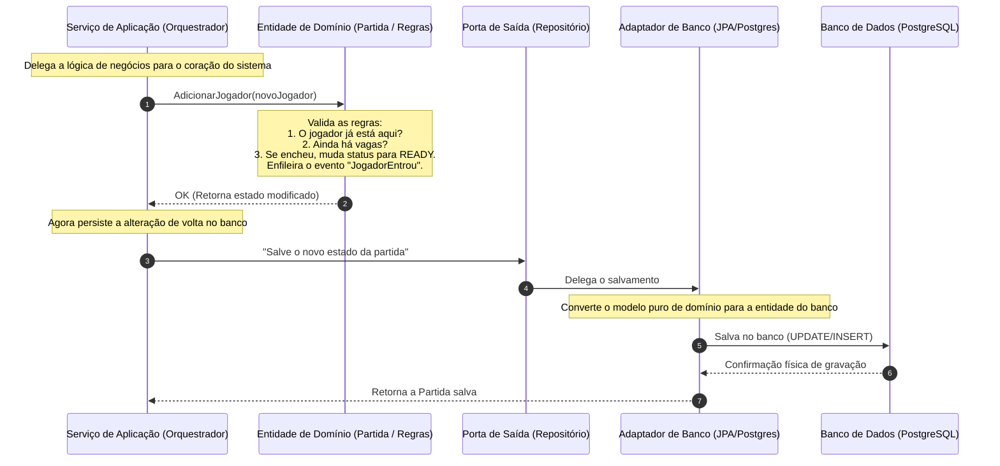
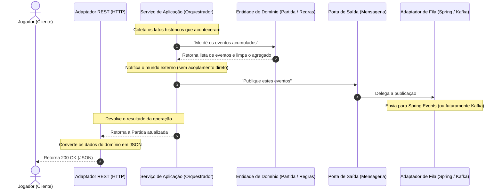

Se você já criou um projeto Spring Boot, talvez conheça esta cena.

Você cria um modelo de domínio, adiciona <code>@Entity</code> em cima da classe, enche os campos com <code>@Column</code>, <code>@Id</code> e <code>@GeneratedValue</code> e, quando percebe, a regra mais importante da sua empresa está ditada pelas limitações do Hibernate. Para piorar, injeta o <code>@Autowired</code> direto no meio da lógica e mistura tratamento HTTP com lógica de negócios.

O resultado é aquele acoplamento que parece inofensivo no começo, mas cobra juros depois. Trocar de banco, atualizar uma biblioteca ou rodar testes unitários rápidos começa a doer mais do que deveria.

A **Arquitetura Hexagonal** (ou Portas e Adaptadores) ataca esse ponto. Ela não é sobre criar pastas bonitas; é sobre isolar o coração do sistema para que as regras continuem funcionando do mesmo jeito, independentemente de quem chamou a operação ou de onde os dados foram salvos.

Para ver como isso funciona na prática, vamos analisar o núcleo de um sistema de **matchmaking em tempo real** (uma plataforma para parear jogadores em partidas online).

---

## A analogia: Restaurante e fornecedores

Imagine um restaurante.

* **A cozinha e as receitas** são o Domínio.
* **A lista de ingredientes exigidos** é a Porta.
* **Os funcionários que recebem e conferem os ingredientes** são os Adaptadores.
* **Os fornecedores** são o banco de dados, APIs, filas etc. (a infraestrutura).

A receita não muda se você trocar o fornecedor de tomates. Desde que os ingredientes cheguem conforme a especificação, a cozinha funciona da mesma forma.

---

## O Mapa do Matchmaking

No nosso sistema de matchmaking, o objetivo é criar partidas, receber jogadores, balancear os times pelo nível de habilidade <code>skillRating</code>, começar o jogo e avisar o mundo sobre as mudanças.

A estrutura de pacotes do projeto segue essa divisão de forma rígida:

```
com.henriquemarino.matchmaking
├── domain          # O coração: regras puras (sem Spring, sem JPA)
│   ├── model       # Match (aggregate root), Player, GameMode...
│   └── events      # MatchCreatedEvent, PlayerJoinedMatchEvent...
├── application     # Orquestrador dos fluxos (Java puro, sem @Service)
│   └── usecases    # CreateMatchService, JoinMatchService...
├── ports           # Os contratos (interfaces)
│   ├── inbound     # O que o mundo de fora pode pedir (Use Cases)
│   └── outbound    # O que a aplicação precisa pedir ao mundo (Repository)
├── adapters        # Os funcionários que recebem os insumos (Adaptadores)
│   ├── inbound     # Controllers REST (HTTP -> API)
│   └── outbound    # JPA / PostgreSQL (Banco) e Spring Events (Mensageria)
└── config          # A central de injeção que une portas e adaptadores
```

A regra de ouro aqui é unidirecional: **as dependências sempre apontam para dentro**.

O domínio está no centro e não conhece ninguém. A aplicação conhece o domínio e as portas. Os adaptadores conhecem as portas e o domínio. O pacote <code>config</code> conhece todo mundo para conseguir costurar as dependências na inicialização.

Antes de entrar nos diagramas, guarde esta bússola:

```txt
HTTP -> Controller -> Porta de Entrada -> Caso de Uso -> Domínio
     -> Porta de Saída -> Adaptador JPA -> Banco
     -> Porta de Saída -> Adaptador de Eventos
```

E aqui está a diferença que mais confunde no começo:

| Tipo | Exemplo no projeto | Quem chama? | Quem implementa? |
| --- | --- | --- | --- |
| Porta de entrada | <code>JoinMatchUseCase</code> | <code>MatchController</code> | <code>JoinMatchService</code> |
| Porta de saída | <code>MatchRepository</code> | <code>JoinMatchService</code> | <code>MatchPersistenceAdapter</code> |
| Porta de saída | <code>DomainEventPublisher</code> | Casos de uso | <code>SpringDomainEventPublisher</code> |

As portas de entrada dizem o que o sistema aceita receber. As portas de saída dizem do que o sistema precisa para terminar o trabalho.

<Callout type="info" title="Um detalhe importante">
Neste artigo, vamos acompanhar principalmente o fluxo de entrada de jogador em uma partida. Ele é pequeno o suficiente para caber na cabeça, mas atravessa todas as camadas: REST, caso de uso, domínio, persistência e eventos.
</Callout>

Se bater dúvida sobre onde uma classe deveria morar, esta tabela resolve boa parte dos casos:

| Camada | Pode depender de | Evite trazer para cá |
| --- | --- | --- |
| <code>domain</code> | Java e tipos do próprio domínio | Spring, JPA, HTTP, banco |
| <code>application</code> | <code>domain</code> e <code>ports</code> | adapters, controllers, repositories JPA |
| <code>ports</code> | linguagem do domínio e comandos/queries | detalhes de infraestrutura |
| <code>adapters</code> | portas, domínio e frameworks | regra de negócio nova |
| <code>config</code> | todas as peças que precisa conectar | regra de negócio |

---

## O Fluxo de uma Ação

O que acontece no sistema quando um jogador pede para entrar em uma partida?

Vamos dividir esse caminho em três etapas. Primeiro o sistema recebe a intenção e busca o estado atual. Depois o domínio aplica as regras. Por fim, a aplicação salva o novo estado, publica os eventos e devolve a resposta.

<Callout type="info" title="Interatividade">
Todos os diagramas abaixo possuem suporte a zoom! Se estiver no computador, passe o mouse sobre o diagrama e clique no botão <strong>Zoom</strong> no canto superior direito para ampliá-lo, arrastá-lo com o mouse e inspecioná-lo confortavelmente de perto.
</Callout>

<figure className="my-8 border border-border/50 rounded-xl bg-light/30 p-5">
  <div className="flex items-center gap-2.5 mb-4 border-b border-border/40 pb-3">
    <span className="bg-emerald-500/10 text-emerald-500 text-xs font-mono uppercase tracking-wider px-2 py-0.5 rounded inline-flex items-center shrink-0">Etapa 1</span>
    <span className="text-base font-semibold text-text leading-none">Recepção e Busca do Estado (Leitura)</span>
  </div>


  <figcaption className="mt-3 text-center text-xs text-text-light/90 border-t border-border/40 pt-3 italic font-medium">
    Chegada da requisição REST, tradução em Command e reidratação do agregado a partir do banco de dados.
  </figcaption>

  <div className="mt-4 text-xs text-text-light/80 leading-relaxed border-t border-border/20 pt-4">
    <strong>O que está acontecendo no código:</strong> O ponto de partida é o <code>MatchController</code> (Adaptador de Entrada REST), que recebe os parâmetros da API e monta um <code>JoinMatchCommand</code>. Ele chama a porta de entrada <code>JoinMatchUseCase</code>. O <code>JoinMatchService</code> assume o fluxo e pede a partida para a porta de saída <code>MatchRepository</code>. Quem atende essa porta é o <code>MatchPersistenceAdapter</code>, que usa Spring Data JPA e o <code>MatchPersistenceMapper</code> para transformar a entidade do banco (<code>MatchJpaEntity</code>) em uma instância limpa de <code>Match</code>. Esse processo de reconstruir o agregado em memória é a <strong>reidratação</strong>.
  </div>
</figure>

<figure className="my-8 border border-border/50 rounded-xl bg-light/30 p-5">
  <div className="flex items-center gap-2.5 mb-4 border-b border-border/40 pb-3">
    <span className="bg-emerald-500/10 text-emerald-500 text-xs font-mono uppercase tracking-wider px-2 py-0.5 rounded inline-flex items-center shrink-0">Etapa 2</span>
    <span className="text-base font-semibold text-text leading-none">Processamento de Regras e Persistência (Escrita)</span>
  </div>



  <figcaption className="mt-3 text-center text-xs text-text-light/90 border-t border-border/40 pt-3 italic font-medium">
    Validação de invariantes de negócio na camada de domínio puro e persistência da partida modificada.
  </figcaption>

  <div className="mt-4 text-xs text-text-light/80 leading-relaxed border-t border-border/20 pt-4">
    <strong>O que está acontecendo no código:</strong> O <code>JoinMatchService</code> não decide se o jogador pode entrar. Ele chama <code>match.join(player)</code> e deixa o domínio trabalhar. A classe <code>Match</code> verifica se o jogador já está na partida, se ainda há vaga e se o status permite entrada. Quando tudo passa, ela adiciona o jogador e registra um <code>PlayerJoinedMatchEvent</code>. Só depois disso a aplicação chama <code>matchRepository.save(match)</code>, e o adaptador de persistência traduz o modelo de domínio atualizado para a entidade JPA.
  </div>
</figure>

<figure className="my-8 border border-border/50 rounded-xl bg-light/30 p-5">
  <div className="flex items-center gap-2.5 mb-4 border-b border-border/40 pb-3">
    <span className="bg-emerald-500/10 text-emerald-500 text-xs font-mono uppercase tracking-wider px-2 py-0.5 rounded inline-flex items-center shrink-0">Etapa 3</span>
    <span className="text-base font-semibold text-text leading-none">Publicação de Eventos e Resposta (Efeitos Colaterais)</span>
  </div>



  <figcaption className="mt-3 text-center text-xs text-text-light/90 border-t border-border/40 pt-3 italic font-medium">
    Coleta de eventos gerados, publicação por meio das portas outbound e tradução da resposta REST.
  </figcaption>

  <div className="mt-4 text-xs text-text-light/80 leading-relaxed border-t border-border/20 pt-4">
    <strong>O que está acontecendo no código:</strong> Depois de salvar, o <code>JoinMatchService</code> chama <code>match.pullDomainEvents()</code>. Esse método copia os eventos acumulados e limpa a lista interna, evitando publicação duplicada. A lista vai para a porta de saída <code>DomainEventPublisher</code>. Hoje, quem implementa essa porta é o <code>SpringDomainEventPublisher</code>, que publica no <code>ApplicationEventPublisher</code> do Spring. A resposta volta ao <code>MatchController</code>, que usa o <code>MatchRestMapper</code> para transformar domínio em <code>MatchResponse</code>.
  </div>
</figure>

---

## Olhando o Código de Perto

Vamos ver como esse isolamento se traduz em classes reais do projeto.

### 1. O coração limpo: <code>Match.java</code> (Domínio)

Aqui estão as regras do jogo. Repare nos imports: **não há Spring, não há JPA**. É Java puro.

O construtor é privado, então ninguém cria uma partida "pela metade". Existem dois caminhos explícitos: <code>create</code>, usado quando uma partida nasce agora, e <code>rehydrate</code>, usado quando o banco devolve os dados de uma partida que já existia.

A lista de eventos também fica dentro do agregado. O domínio registra que algo aconteceu, mas não publica nada sozinho. Publicar é trabalho da camada de aplicação por meio de uma porta.

O recorte abaixo omite alguns campos de tempo e resultado para manter o foco nas regras principais.

```java
package com.henriquemarino.matchmaking.domain.model;

import com.henriquemarino.matchmaking.domain.events.DomainEvent;
import com.henriquemarino.matchmaking.domain.events.MatchCreatedEvent;
import com.henriquemarino.matchmaking.domain.events.PlayerJoinedMatchEvent;
import com.henriquemarino.matchmaking.domain.exceptions.InvalidMatchStateException;
import com.henriquemarino.matchmaking.domain.exceptions.MatchFullException;
import com.henriquemarino.matchmaking.domain.exceptions.PlayerAlreadyInMatchException;

import java.util.ArrayList;
import java.util.List;
import java.util.Objects;

public class Match {
    private final MatchId id;
    private final GameMode gameMode;
    private MatchStatus status;
    private final List<Player> players;
    private final List<DomainEvent> domainEvents = new ArrayList<>();

    private Match(MatchId id, GameMode gameMode, MatchStatus status, List<Player> players) {
        this.id = id;
        this.gameMode = gameMode;
        this.status = status;
        this.players = players;
    }

    public static Match create(MatchId id, GameMode gameMode) {
        Objects.requireNonNull(id, "MatchId não pode ser nulo");
        Objects.requireNonNull(gameMode, "GameMode não pode ser nulo");

        Match match = new Match(id, gameMode, MatchStatus.WAITING_FOR_PLAYERS, new ArrayList<>());
        match.recordEvent(MatchCreatedEvent.of(id, gameMode));
        return match;
    }

    public static Match rehydrate(
            MatchId id,
            GameMode gameMode,
            MatchStatus status,
            List<Player> players
    ) {
        return new Match(id, gameMode, status, new ArrayList<>(players));
    }

    public void join(Player player) {
        Objects.requireNonNull(player, "Player não pode ser nulo");

        if (players.contains(player)) {
            throw new PlayerAlreadyInMatchException(id, player.id());
        }
        if (status == MatchStatus.READY) {
            throw new MatchFullException(id, gameMode.capacity());
        }
        if (status != MatchStatus.WAITING_FOR_PLAYERS) {
            throw new InvalidMatchStateException(id, status, "entrar em");
        }

        players.add(player);
        recordEvent(PlayerJoinedMatchEvent.of(id, player.id(), players.size(), gameMode.capacity()));

        if (players.size() == gameMode.capacity()) {
            status = MatchStatus.READY;
        }
    }

    public List<DomainEvent> pullDomainEvents() {
        List<DomainEvent> pulled = List.copyOf(domainEvents);
        domainEvents.clear();
        return pulled;
    }

    private void recordEvent(DomainEvent event) {
        domainEvents.add(event);
    }
}
```

### 2. A Porta (Lista de Ingredientes): <code>MatchRepository.java</code>

Nossa aplicação precisa salvar partidas, mas ela não pode saber *como*. Criamos uma interface na camada de <code>ports/outbound</code> que fala a linguagem do domínio:

```java
package com.henriquemarino.matchmaking.ports.outbound;

import com.henriquemarino.matchmaking.domain.model.Match;
import com.henriquemarino.matchmaking.domain.model.MatchId;
import java.util.Optional;

public interface MatchRepository {
    Match save(Match match);
    Optional<Match> findById(MatchId matchId);

    // ... além das consultas de histórico (findFinishedMatches, findFinishedMatchesByPlayer)
}
```

### 3. O Organizador (Caso de Uso): <code>JoinMatchService.java</code>

A classe que orquestra a entrada do jogador não tem <code>@Service</code> do Spring. Ela recebe suas dependências pelo construtor, sempre pelas portas. Isso facilita muito o teste: no lugar de um banco real, podemos passar um repositório em memória.

```java
package com.henriquemarino.matchmaking.application.usecases;

import com.henriquemarino.matchmaking.application.commands.JoinMatchCommand;
import com.henriquemarino.matchmaking.domain.exceptions.MatchNotFoundException;
import com.henriquemarino.matchmaking.domain.model.Match;
import com.henriquemarino.matchmaking.domain.model.Player;
import com.henriquemarino.matchmaking.ports.inbound.JoinMatchUseCase;
import com.henriquemarino.matchmaking.ports.outbound.DomainEventPublisher;
import com.henriquemarino.matchmaking.ports.outbound.MatchRepository;

public class JoinMatchService implements JoinMatchUseCase {

    private final MatchRepository matchRepository;
    private final DomainEventPublisher eventPublisher;

    public JoinMatchService(MatchRepository matchRepository, DomainEventPublisher eventPublisher) {
        this.matchRepository = matchRepository;
        this.eventPublisher = eventPublisher;
    }

    @Override
    public Match join(JoinMatchCommand command) {
        Match match = matchRepository.findById(command.matchId())
                .orElseThrow(() -> new MatchNotFoundException(command.matchId()));

        match.join(Player.join(command.playerId(), command.skillRating()));

        Match saved = matchRepository.save(match);
        eventPublisher.publishAll(match.pullDomainEvents());

        return saved;
    }
}
```

Perceba a divisão: o caso de uso define a ordem dos passos, mas não decide se o jogador pode entrar. Essa decisão fica no <code>Match</code>.

### 4. Onde o <code>skillRating</code> entra: <code>SkillBasedTeamBalancingStrategy.java</code>

Até aqui, vimos o jogador entrando na partida. Mas matchmaking não é só preencher uma sala; também é montar times minimamente justos.

No projeto, essa regra fica em um serviço de domínio: <code>SkillBasedTeamBalancingStrategy</code>. O <code>Match</code> sabe quando pode começar. A estratégia sabe como distribuir jogadores entre os times.

```java
public void start(TeamBalancingStrategy balancingStrategy) {
    if (status != MatchStatus.READY) {
        throw new InvalidMatchStateException(id, status, "iniciar");
    }

    balancingStrategy.balance(players);
    status = MatchStatus.IN_PROGRESS;
    startedAt = Instant.now();
    recordEvent(MatchStartedEvent.of(id, startedAt));
}
```

E a estratégia usa o <code>skillRating</code> para tentar equilibrar os lados:

```java
public class SkillBasedTeamBalancingStrategy implements TeamBalancingStrategy {

    @Override
    public void balance(List<Player> players) {
        List<Player> ordered = new ArrayList<>(players);
        ordered.sort(Comparator.comparingInt(Player::skillRating).reversed());

        int skillOfTeamA = 0;
        int skillOfTeamB = 0;
        int sizeOfTeamA = 0;
        int sizeOfTeamB = 0;
        int halfSize = ordered.size() / 2;

        for (Player player : ordered) {
            boolean teamAisFull = sizeOfTeamA == halfSize;
            boolean teamBisFull = sizeOfTeamB == halfSize;
            boolean goToTeamA = !teamAisFull && (teamBisFull || skillOfTeamA <= skillOfTeamB);

            if (goToTeamA) {
                player.assignTeam(Team.TEAM_A);
                skillOfTeamA += player.skillRating();
                sizeOfTeamA++;
            } else {
                player.assignTeam(Team.TEAM_B);
                skillOfTeamB += player.skillRating();
                sizeOfTeamB++;
            }
        }
    }
}
```

Esse é um bom exemplo de domínio rico sem virar bagunça. A regra de estado continua dentro de <code>Match</code>. A regra de balanceamento, que é uma política própria e pode mudar com o tempo, fica em uma estratégia separada.

### 5. O Adaptador (Funcionário/Conferente): <code>MatchPersistenceAdapter.java</code>

Aqui a infraestrutura entra. Este adaptador fica em <code>adapters/outbound/persistence</code>. Ele implementa a interface <code>MatchRepository</code> (porta) usando a infraestrutura do Spring Data JPA.

Para evitar que anotações do banco poluam o domínio, temos classes separadas: <code>Match</code> (do domínio) e <code>MatchJpaEntity</code> (do banco). O mapper faz a conversão entre as duas.

```java
package com.henriquemarino.matchmaking.adapters.outbound.persistence;

import com.henriquemarino.matchmaking.domain.model.Match;
import com.henriquemarino.matchmaking.ports.outbound.MatchRepository;
import org.springframework.stereotype.Repository;

@Repository
public class MatchPersistenceAdapter implements MatchRepository {

    private final SpringDataMatchRepository jpaRepository;
    private final MatchPersistenceMapper mapper;

    public MatchPersistenceAdapter(SpringDataMatchRepository jpaRepository, MatchPersistenceMapper mapper) {
        this.jpaRepository = jpaRepository;
        this.mapper = mapper;
    }

    @Override
    public Match save(Match match) {
        // Converte o modelo puro de domínio para a entidade anotada com JPA
        MatchJpaEntity entity = jpaRepository.findById(match.id().value())
                .map(existing -> {
                    mapper.updateEntity(existing, match);
                    return existing;
                })
                .orElseGet(() -> mapper.toNewEntity(match));

        // Salva de fato no banco e converte de volta para o domínio
        return mapper.toDomain(jpaRepository.save(entity));
    }

    // ... findById
}
```

### 6. O ganho aparece nos testes

Até aqui, a separação pode parecer um custo: interfaces, mappers, comandos, adaptadores. O ponto em que ela começa a pagar é no teste.

No projeto, os testes dos casos de uso não precisam subir PostgreSQL, container, contexto Spring nem servidor HTTP. Eles montam o caso de uso com implementações simples das portas:

```java
@BeforeEach
void setUp() {
    repository = new InMemoryMatchRepository();
    publisher = new RecordingEventPublisher();

    createMatch = new CreateMatchService(new MatchFactory(), repository, publisher);
    joinMatch = new JoinMatchService(repository, publisher);
    startMatch = new StartMatchService(repository, new SkillBasedTeamBalancingStrategy(), publisher);
    finishMatch = new FinishMatchService(repository, publisher);
    getHistory = new GetMatchHistoryService(repository);
}
```

Esse teste conta a história inteira da partida:

```java
@Test
void fullLifecycleShouldEndInHistory() {
    Match created = createMatch.create(new CreateMatchCommand(GameMode.SOLO_DUEL));
    MatchId matchId = created.id();
    PlayerId playerOne = PlayerId.newId();

    joinMatch.join(new JoinMatchCommand(matchId, playerOne, 100));
    Match ready = joinMatch.join(new JoinMatchCommand(matchId, PlayerId.newId(), 80));
    assertThat(ready.status()).isEqualTo(MatchStatus.READY);

    Match started = startMatch.start(new StartMatchCommand(matchId));
    assertThat(started.status()).isEqualTo(MatchStatus.IN_PROGRESS);
    assertThat(started.players()).allMatch(p -> p.team().isPlayable());

    Match finished = finishMatch.finish(new FinishMatchCommand(matchId, Team.TEAM_A, "GG"));
    assertThat(finished.status()).isEqualTo(MatchStatus.FINISHED);

    assertThat(getHistory.getHistory(GetMatchHistoryQuery.forPlayer(playerOne))).hasSize(1);
}
```

Esse é o tipo de teste que eu gosto de ver em domínio com regra. Ele lê quase como uma especificação: cria, recebe jogadores, fica pronto, começa, termina e aparece no histórico.

---

## E se precisarmos do Kafka?

Hoje, o sistema publica eventos localmente (usando o <code>ApplicationEventPublisher</code> do Spring) para que um listener simples grave logs.

Mas e se amanhã a plataforma crescer e precisarmos mandar esses eventos para o **Apache Kafka** para avisar outros microsserviços (como o de ranking e de conquistas)?

Em uma arquitetura acoplada, esse tipo de mudança costuma espalhar Kafka por lugares onde Kafka não deveria aparecer: services de negócio, entidades, métodos que antes só cuidavam da partida.

Aqui, o caminho é mais estreito. O domínio continua registrando eventos. A aplicação continua chamando <code>DomainEventPublisher</code>. O que muda é o adaptador por trás dessa porta:

```java
@Component
public class KafkaDomainEventPublisher implements DomainEventPublisher {
    private final KafkaTemplate<String, Object> kafkaTemplate;

    public KafkaDomainEventPublisher(KafkaTemplate<String, Object> kafkaTemplate) {
        this.kafkaTemplate = kafkaTemplate;
    }

    @Override
    public void publishAll(List<DomainEvent> events) {
        events.forEach(event -> kafkaTemplate.send("matchmaking-events", event));
    }
}
```

Depois disso, a configuração escolhe qual implementação será injetada: a atual, baseada em Spring Events, ou a nova, baseada em Kafka. O ponto importante é o que não muda: <code>Match.java</code>, <code>JoinMatchService.java</code> e a porta <code>DomainEventPublisher</code> continuam falando a mesma língua.

<Callout type="warning" title="Produção pede um passo a mais">
Para um sistema real, eu não publicaria direto para Kafka e dormiria tranquilo. O próximo cuidado seria usar o padrão <strong>Outbox</strong>: salvar o evento na mesma transação da partida e publicar depois. Assim evitamos o caso ruim de salvar o estado no banco e perder o aviso para os outros serviços.
</Callout>

A receita e a cozinha continuaram as mesmas. Mudamos o fornecedor.

---

<Callout type="info" title="Os Mappers valem a pena?">
Ter duas representações do mesmo dado, como <code>Match</code> e <code>MatchJpaEntity</code>, dá trabalho. Você escreve mapper, teste, conversão de ida e volta. A troca é simples: você aceita esse custo para impedir que o modelo de domínio vire uma extensão do Hibernate.
</Callout>

## Quando NÃO usar?

Arquitetura Hexagonal tem preço: mais arquivos, mais interfaces e mais lugares para navegar. Em troca, você ganha isolamento, testes mais leves e liberdade para trocar infraestrutura com menos trauma.

Se o sistema é um CRUD simples, onde a regra é basicamente validar campos e salvar no banco, talvez isso seja arquitetura demais para problema de menos. Você vai gastar energia criando DTOs, commands, entities, mappers e interfaces sem receber tanto de volta.

Use a Arquitetura Hexagonal quando:
* O domínio tem regras complexas, mutáveis e que precisam de testes unitários rápidos.
* O ecossistema de infraestrutura ao redor é incerto (o banco pode mudar, a forma de mensageria pode evoluir).
* Você precisa proteger o ativo mais valioso da empresa: as regras de negócio.

## Resumo de bolso

Se eu tivesse que reduzir tudo a poucas frases, ficaria assim:

* O **domínio** guarda as regras e não importa framework.
* A **aplicação** coordena os passos, mas não inventa regra de negócio.
* As **portas** são contratos: o que entra e o que precisa sair.
* Os **adaptadores** traduzem HTTP, banco, eventos e qualquer outra infraestrutura.
* A camada de **config** junta as peças sem contaminar o miolo.

No matchmaking, essa separação fica bem concreta: o <code>Match</code> protege o estado da partida, os casos de uso conduzem o fluxo, o JPA fica do lado de fora e os eventos podem sair por Spring Events hoje ou por Kafka amanhã. O desenho só vale a pena porque as regras da partida merecem essa proteção.
