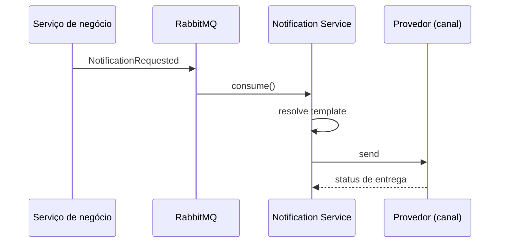

## Problema

Aplicações crescem rápido quando cada serviço começa a enviar e-mails, SMS ou webhooks por conta própria. O resultado costuma ser duplicação de template, retries inconsistentes e pouca visibilidade de falhas.

Este serviço isola essa responsabilidade em uma fronteira clara.

## Fluxo



## Responsabilidades

| Responsabilidade | Implementação |
| --- | --- |
| Entrada assíncrona | Eventos em RabbitMQ (Producer/Consumer) |
| Templates | Resolução por tipo de notificação |
| Provedor | Adaptadores por canal/provedor |
| Confiabilidade | Retry, logs estruturados e idempotência |

<Callout type="success" title="Boa fronteira">
Serviços de negócio publicam intenção. O serviço de notificação decide canal, template, provedor e política de retry.
</Callout>

```java
public interface NotificationProvider {
    ProviderResult send(NotificationMessage message);
}
```
