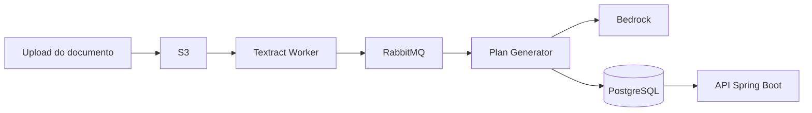

## Contexto

Rehab.AI é um projeto pessoal para explorar como IA pode apoiar fluxos clínicos sem remover a etapa de validação humana. A ideia central é receber documentos, extrair informações úteis e sugerir planos de tratamento que possam ser revisados por profissionais.

<Callout type="info" title="Decisão de arquitetura">
O projeto foi pensado como um sistema orientado a eventos para desacoplar ingestão de documentos, processamento com IA e persistência do plano final.
</Callout>

## Arquitetura



## Stack

| Camada | Tecnologia | Motivo |
| --- | --- | --- |
| API | Spring Boot | Ecossistema maduro e boas abstrações para serviços backend |
| Banco | PostgreSQL | Consistência transacional e modelagem relacional |
| Mensageria | RabbitMQ | Processamento assíncrono e retentativas controladas |
| IA/documentos | Textract + Bedrock | Extração e geração assistida com serviços gerenciados |

## Aprendizados

- Separar ingestão de documento do fluxo de geração reduz acoplamento e melhora observabilidade.
- Mensagens precisam carregar contexto suficiente para reprocessamento, mas não todo o payload.
- IA em produto técnico precisa de trilha de auditoria, revisão e limites bem definidos.

```java
public record TreatmentPlanRequested(
    UUID documentId,
    UUID patientId,
    Instant requestedAt
) {}
```
